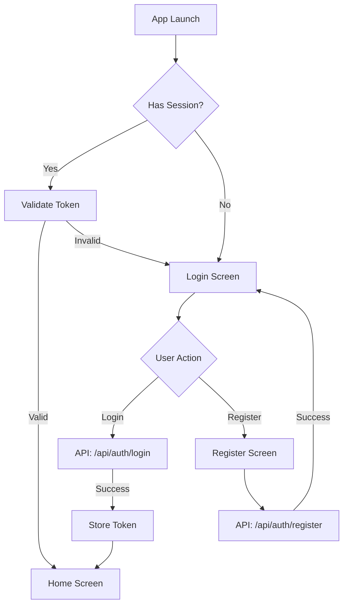

# Mobile Application Documentation

> **Single Source of Truth** for mobile app development integrating with the existing e-commerce web platform.

---

## 1. File Overview

| Attribute | Details |
|-----------|---------|
| **File Name** | `mobile.md` |
| **Purpose** | E-commerce mobile application mirroring the existing Next.js web platform |
| **Target Platforms** | Android & iOS (Cross-platform) |
| **Tech Stack** | React Native with Expo |
| **Backend Dependency** | Existing Next.js API routes at `/api/*` |
| **Storage** | Supabase (images), MongoDB (data) |
| **Payment Gateway** | eSewa integration |

### App Goals
- Provide native mobile shopping experience
- Full feature parity with web platform
- Offline-capable with local data caching
- Personalized recommendations based on user behavior
- Seamless authentication with web platform

---

## 2. App Architecture

### 2.1 Architecture Pattern
**MVVM (Model-View-ViewModel)** with Clean Architecture principles.

```
┌─────────────────────────────────────────────────────────────┐
│                      PRESENTATION LAYER                      │
│  ┌─────────────┐  ┌─────────────┐  ┌─────────────┐          │
│  │   Screens   │  │  Components │  │  ViewModels │          │
│  └─────────────┘  └─────────────┘  └─────────────┘          │
├─────────────────────────────────────────────────────────────┤
│                       DOMAIN LAYER                           │
│  ┌─────────────┐  ┌─────────────┐  ┌─────────────┐          │
│  │  Use Cases  │  │   Models    │  │ Repositories│          │
│  └─────────────┘  └─────────────┘  └─────────────┘          │
├─────────────────────────────────────────────────────────────┤
│                        DATA LAYER                            │
│  ┌─────────────┐  ┌─────────────┐  ┌─────────────┐          │
│  │ API Service │  │Local Storage│  │  Supabase   │          │
│  └─────────────┘  └─────────────┘  └─────────────┘          │
└─────────────────────────────────────────────────────────────┘
```

### 2.2 Separation of Concerns

| Layer | Responsibility |
|-------|----------------|
| **UI Layer** | Screens, components, navigation, user interactions |
| **Business Logic** | ViewModels, state management, use cases |
| **Data Layer** | API calls, local storage, data synchronization |

### 2.3 State Management
- **Global State**: React Context API + useReducer for auth, cart, theme
- **Server State**: React Query (TanStack Query) for API data caching
- **Local State**: useState/useReducer for component-level state

### 2.4 Offline vs Online Behavior

| Mode | Behavior |
|------|----------|
| **Online** | Full API access, real-time sync, immediate updates |
| **Offline** | Read from local cache, queue write operations, sync on reconnect |
| **Partial** | Graceful degradation, show cached data with stale indicators |

---

## 3. Folder & File Structure

```
src/
├── app/                          # Expo Router app directory
│   ├── (auth)/                   # Auth route group
│   │   ├── login.jsx
│   │   ├── register.jsx
│   │   └── _layout.jsx
│   ├── (tabs)/                   # Main tab navigation
│   │   ├── home.jsx
│   │   ├── search.jsx
│   │   ├── cart.jsx
│   │   ├── foryou.jsx
│   │   ├── profile.jsx
│   │   └── _layout.jsx
│   ├── (owner)/                  # Owner/Admin screens
│   │   ├── dashboard.jsx
│   │   ├── products/
│   │   │   ├── index.jsx
│   │   │   ├── [id].jsx
│   │   │   └── add.jsx
│   │   ├── orders.jsx
│   │   └── _layout.jsx
│   ├── product/
│   │   └── [id].jsx              # Product detail screen
│   ├── category/
│   │   └── [name].jsx
│   ├── checkout.jsx
│   ├── _layout.jsx               # Root layout
│   └── index.jsx                 # Entry redirect
│
├── components/                   # Reusable UI components
│   ├── cart/
│   │   ├── CartItem.jsx
│   │   ├── CartSummary.jsx
│   │   └── CartBadge.jsx
│   ├── products/
│   │   ├── ProductCard.jsx
│   │   ├── ProductGrid.jsx
│   │   ├── ProductImage.jsx
│   │   └── ProductDetails.jsx
│   ├── categories/
│   │   ├── CategoryList.jsx
│   │   └── CategoryCard.jsx
│   ├── layout/
│   │   ├── Header.jsx
│   │   ├── TabBar.jsx
│   │   └── SafeContainer.jsx
│   ├── search/
│   │   ├── SearchBar.jsx
│   │   └── SearchResults.jsx
│   └── ui/
│       ├── Button.jsx
│       ├── Input.jsx
│       ├── Card.jsx
│       ├── Modal.jsx
│       ├── Badge.jsx
│       ├── Skeleton.jsx
│       └── Toast.jsx
│
├── services/                     # API and external services
│   ├── api/
│   │   ├── client.js             # Axios instance configuration
│   │   ├── auth.js               # Auth endpoints
│   │   ├── products.js           # Product endpoints
│   │   ├── cart.js               # Cart endpoints
│   │   ├── orders.js             # Order endpoints
│   │   ├── user.js               # User profile endpoints
│   │   └── recommendations.js    # For You recommendations
│   ├── storage/
│   │   ├── secureStorage.js      # Encrypted credential storage
│   │   ├── asyncStorage.js       # General local storage
│   │   └── cache.js              # Data caching utilities
│   └── payment/
│       └── esewa.js              # eSewa payment integration
│
├── models/                       # Data models/types
│   ├── User.js
│   ├── Product.js
│   ├── Order.js
│   ├── Cart.js
│   └── Category.js
│
├── context/                      # React Context providers
│   ├── AuthContext.jsx
│   ├── CartContext.jsx
│   ├── ThemeContext.jsx
│   └── NetworkContext.jsx
│
├── hooks/                        # Custom React hooks
│   ├── useAuth.js
│   ├── useCart.js
│   ├── useProducts.js
│   ├── useNetwork.js
│   └── useDebounce.js
│
├── utils/                        # Utility functions
│   ├── formatters.js             # Price, date formatting
│   ├── validators.js             # Input validation
│   ├── constants.js              # App constants
│   └── helpers.js                # General helpers
│
├── theme/                        # Theme configuration
│   ├── colors.js
│   ├── typography.js
│   ├── spacing.js
│   └── index.js
│
└── assets/                       # Static assets
    ├── images/
    ├── icons/
    └── fonts/
```

---

## 4. UI/UX & Styling Guidelines

### 4.1 Design Principles
- **Mobile-first**: Optimized touch targets (min 44px), thumb-friendly navigation
- **Accessibility**: WCAG 2.1 AA compliant, screen reader support, dynamic font scaling
- **Consistency**: Mirror web platform visual language
- **Performance**: 60fps animations, lazy loading, skeleton states

### 4.2 Color Palette

| Token | Light Mode | Dark Mode | Usage |
|-------|------------|-----------|-------|
| `primary` | `#D97706` (Amber 600) | `#F59E0B` (Amber 500) | Primary actions, branding |
| `background` | `#F9FAFB` (Gray 50) | `#020617` (Slate 950) | App background |
| `surface` | `#FFFFFF` | `#0F172A` (Slate 900) | Cards, modals |
| `text` | `#0F172A` (Slate 900) | `#F1F5F9` (Slate 100) | Primary text |
| `textSecondary` | `#475569` (Slate 600) | `#94A3B8` (Slate 400) | Secondary text |
| `border` | `#E2E8F0` (Slate 200) | `#1E293B` (Slate 800) | Borders, dividers |
| `success` | `#059669` (Emerald 600) | `#059669` | Success states |
| `danger` | `#DC2626` (Red 600) | `#DC2626` | Error states |
| `warning` | `#D97706` (Amber 600) | `#D97706` | Warning states |
| `price` | `#D97706` (Amber 600) | `#F59E0B` (Amber 400) | Price display |

### 4.3 Typography

| Style | Font | Size | Weight | Line Height |
|-------|------|------|--------|-------------|
| `h1` | Inter | 32px | Bold (700) | 1.2 |
| `h2` | Inter | 24px | SemiBold (600) | 1.25 |
| `h3` | Inter | 20px | SemiBold (600) | 1.3 |
| `body` | Inter | 16px | Regular (400) | 1.5 |
| `bodySmall` | Inter | 14px | Regular (400) | 1.5 |
| `caption` | Inter | 12px | Regular (400) | 1.4 |
| `button` | Inter | 16px | Medium (500) | 1 |
| `price` | Inter | 18px | Bold (700) | 1.2 |

### 4.4 Spacing System

```javascript
const spacing = {
  xs: 4,
  sm: 8,
  md: 16,
  lg: 24,
  xl: 32,
  xxl: 48,
};
```

### 4.5 Button Styles

| Variant | Style |
|---------|-------|
| **Primary** | Amber background, white text, rounded-lg, shadow |
| **Secondary** | White background, slate border, slate text |
| **Ghost** | Transparent, slate text, hover background |
| **Danger** | Red background, white text |

```javascript
// Primary Button
{
  backgroundColor: colors.primary,
  paddingVertical: spacing.md,
  paddingHorizontal: spacing.lg,
  borderRadius: 8,
  shadowColor: '#000',
  shadowOpacity: 0.1,
  shadowRadius: 4,
}
```

### 4.6 Form Input Styles

```javascript
// Input Field
{
  borderWidth: 1,
  borderColor: colors.border,
  borderRadius: 8,
  paddingVertical: spacing.md,
  paddingHorizontal: spacing.md,
  fontSize: 16,
  // Focus state
  focusBorderColor: colors.primary,
}
```

### 4.7 Error & Success Messages

| Type | Background | Text Color | Icon |
|------|------------|------------|------|
| **Error** | `#FEF2F2` | `#DC2626` | ❌ |
| **Success** | `#ECFDF5` | `#059669` | ✓ |
| **Warning** | `#FFFBEB` | `#D97706` | ⚠ |
| **Info** | `#EFF6FF` | `#2563EB` | ℹ |

### 4.8 Light/Dark Mode Handling

```javascript
// ThemeContext.jsx
const ThemeContext = createContext();

export function ThemeProvider({ children }) {
  const [isDark, setIsDark] = useState(false);
  const theme = isDark ? darkTheme : lightTheme;
  
  useEffect(() => {
    // Persist preference
    AsyncStorage.setItem('theme', isDark ? 'dark' : 'light');
  }, [isDark]);
  
  return (
    <ThemeContext.Provider value={{ theme, isDark, toggleTheme }}>
      {children}
    </ThemeContext.Provider>
  );
}
```

---

## 5. Navigation Flow

### 5.1 App Entry Point

```
App Launch
    │
    ▼
Check Session Token
    │
    ├── Valid Token ──▶ Main App (Tabs)
    │
    └── No Token ──▶ Auth Stack (Login/Register)
```

### 5.2 Authentication Flow



### 5.3 Main Navigation Structure

**Tab Navigation (Bottom Tabs)**

| Tab | Icon | Screen | Protected |
|-----|------|--------|-----------|
| Home | 🏠 | Product listings, categories | No |
| Search | 🔍 | Search with filters | No |
| For You | ❤️ | Personalized recommendations | Yes |
| Cart | 🛒 | Shopping cart | Yes |
| Profile | 👤 | User profile, orders, settings | Yes |

### 5.4 Screen-to-Screen Transitions

```
Home
├── Product List → Product Detail → Add to Cart
├── Category Card → Category Products → Product Detail
└── Banner → Promotional Products

Search
├── Search Bar → Search Results → Product Detail
└── Filters → Filtered Results

For You (Protected)
└── Recommendations → Product Detail

Cart (Protected)
├── Cart Items → Update Quantity
├── Remove Item
└── Checkout → Payment → Order Confirmation

Profile (Protected)
├── Edit Profile
├── Addresses → Add/Edit Address
├── Orders → Order Detail
├── Settings → Theme Toggle
└── Logout
```

### 5.5 Protected vs Public Screens

| Public | Protected (Requires Auth) |
|--------|---------------------------|
| Home | For You |
| Search | Cart |
| Product Detail | Profile |
| Categories | Checkout |
| Login/Register | Orders |
| | Owner Dashboard |

---

## 6. Authentication & Authorization Logic

### 6.1 Login/Signup Process

**Login Flow:**
```javascript
async function login(email, password) {
  const response = await api.post('/api/auth/login', { email, password });
  const { sessionToken, user } = response.data;
  
  // Store securely
  await SecureStore.setItemAsync('sessionToken', sessionToken);
  await AsyncStorage.setItem('user', JSON.stringify(user));
  
  // Update context
  setUser(user);
  setIsAuthenticated(true);
}
```

**Register Flow:**
```javascript
async function register(userData) {
  await api.post('/api/auth/register', {
    username: userData.username,
    email: userData.email,
    password: userData.password  // Encrypted before sending
  });
  // Redirect to login after successful registration
}
```

### 6.2 Token Handling

| Aspect | Implementation |
|--------|----------------|
| **Token Type** | Session Token (UUID stored in MongoDB) |
| **Storage** | Expo SecureStore (encrypted) |
| **Transmission** | Cookie header or Authorization header |
| **Validation** | Server-side lookup in User.sessionToken |

### 6.3 Secure Storage

```javascript
// services/storage/secureStorage.js
import * as SecureStore from 'expo-secure-store';

export const secureStorage = {
  async setToken(token) {
    await SecureStore.setItemAsync('sessionToken', token);
  },
  
  async getToken() {
    return await SecureStore.getItemAsync('sessionToken');
  },
  
  async removeToken() {
    await SecureStore.deleteItemAsync('sessionToken');
  }
};
```

### 6.4 Role-Based Access

| Role | Access Level |
|------|--------------|
| **Guest** | Browse products, search, view details |
| **User** | + Cart, orders, recommendations, profile |
| **Owner** | + Admin dashboard, product management, order management |

```javascript
// Navigation guard
function ProtectedRoute({ children, requireOwner = false }) {
  const { user, isAuthenticated } = useAuth();
  
  if (!isAuthenticated) {
    return <Redirect href="/login" />;
  }
  
  if (requireOwner && !user.isOwner) {
    return <Redirect href="/" />;
  }
  
  return children;
}
```

### 6.5 Logout & Token Expiration

```javascript
async function logout() {
  try {
    await api.post('/api/auth/logout');
  } finally {
    await secureStorage.removeToken();
    await AsyncStorage.removeItem('user');
    setUser(null);
    setIsAuthenticated(false);
    router.replace('/login');
  }
}

// Auto-logout on 401 response
api.interceptors.response.use(
  response => response,
  error => {
    if (error.response?.status === 401) {
      logout();
    }
    return Promise.reject(error);
  }
);
```

---

## 7. Database & Data Management

### 7.1 Local Storage Strategy

| Storage Type | Use Case | Library |
|--------------|----------|---------|
| **SecureStore** | Session tokens, credentials | expo-secure-store |
| **AsyncStorage** | User preferences, cached data | @react-native-async-storage |
| **React Query Cache** | API response caching | @tanstack/react-query |

### 7.2 Cached Data Strategy

```javascript
// React Query configuration
const queryClient = new QueryClient({
  defaultOptions: {
    queries: {
      staleTime: 5 * 60 * 1000,    // 5 minutes
      cacheTime: 30 * 60 * 1000,   // 30 minutes
      retry: 2,
      refetchOnWindowFocus: true,
    },
  },
});
```

### 7.3 Data Synchronization

```javascript
// Sync queue for offline operations
const syncQueue = {
  async add(operation) {
    const queue = await AsyncStorage.getItem('syncQueue') || '[]';
    const parsed = JSON.parse(queue);
    parsed.push({ ...operation, timestamp: Date.now() });
    await AsyncStorage.setItem('syncQueue', JSON.stringify(parsed));
  },
  
  async process() {
    const queue = JSON.parse(await AsyncStorage.getItem('syncQueue') || '[]');
    for (const op of queue) {
      try {
        await api[op.method](op.url, op.data);
        // Remove from queue on success
      } catch (error) {
        // Keep in queue for retry
      }
    }
  }
};
```

### 7.4 Offline Data Handling

| Action | Online | Offline |
|--------|--------|---------|
| Browse products | API fetch | Show cached |
| Add to cart | Immediate sync | Queue operation |
| View cart | API fetch | Local cart state |
| Checkout | Process payment | Block with message |
| View orders | API fetch | Show cached |

### 7.5 Data Validation

```javascript
// validators.js
export const validators = {
  email: (value) => /^[^\s@]+@[^\s@]+\.[^\s@]+$/.test(value),
  
  password: (value) => value.length >= 6,
  
  phone: (value) => /^\d{10}$/.test(value),
  
  required: (value) => value && value.trim().length > 0,
  
  quantity: (value) => Number.isInteger(value) && value > 0,
};
```

---

## 8. API & Backend Integration

### 8.1 Base API Configuration

```javascript
// services/api/client.js
import axios from 'axios';
import { secureStorage } from '../storage/secureStorage';

const API_BASE_URL = process.env.EXPO_PUBLIC_API_URL || 'https://your-domain.com';

const api = axios.create({
  baseURL: API_BASE_URL,
  timeout: 15000,
  headers: {
    'Content-Type': 'application/json',
  },
});

// Request interceptor - add auth token
api.interceptors.request.use(async (config) => {
  const token = await secureStorage.getToken();
  if (token) {
    config.headers.Cookie = `session=${token}`;
  }
  return config;
});

export default api;
```

### 8.2 API Endpoints

| Endpoint | Method | Description | Auth |
|----------|--------|-------------|------|
| `/api/auth/login` | POST | User login | No |
| `/api/auth/register` | POST | User registration | No |
| `/api/auth/logout` | POST | User logout | Yes |
| `/api/auth/session` | GET | Validate session | Yes |
| `/api/products/list` | GET | Get all products | No |
| `/api/products/[id]` | GET | Get product by ID | No |
| `/api/products/search` | GET | Search products | No |
| `/api/products/foryou` | GET | Recommendations | Yes |
| `/api/products/subcategory` | GET | Products by subcategory | No |
| `/api/products/tag` | GET | Products by tag | No |
| `/api/cart` | GET | Get user cart | Yes |
| `/api/cart/add` | POST | Add to cart | Yes |
| `/api/cart/remove` | DELETE | Remove from cart | Yes |
| `/api/cart/update` | PUT | Update quantity | Yes |
| `/api/user/profile` | GET/PUT | User profile | Yes |
| `/api/user/orders` | GET | User orders | Yes |
| `/api/payment/esewa` | POST | Initiate payment | Yes |

### 8.3 Request/Response Structure

**Request:**
```javascript
// POST /api/auth/login
{
  email: "user@example.com",
  password: "encrypted_password"
}
```

**Response (Success):**
```javascript
{
  success: true,
  data: {
    user: { username, email, isOwner, ... },
    sessionToken: "uuid-session-token"
  }
}
```

**Response (Error):**
```javascript
{
  success: false,
  error: "Invalid credentials",
  code: "AUTH_INVALID"
}
```

### 8.4 Error Handling Standards

```javascript
// Global error handler
api.interceptors.response.use(
  response => response,
  error => {
    const message = error.response?.data?.error || 'Network error';
    const status = error.response?.status;
    
    switch (status) {
      case 401:
        // Handle unauthorized
        break;
      case 403:
        // Handle forbidden
        break;
      case 404:
        // Handle not found
        break;
      case 500:
        // Handle server error
        break;
    }
    
    return Promise.reject({ message, status });
  }
);
```

### 8.5 Pagination & Filtering

```javascript
// GET /api/products/list?page=1&limit=20&category=Electronics&sort=price_asc
const fetchProducts = async ({ page = 1, limit = 20, category, sort }) => {
  const params = new URLSearchParams({ page, limit });
  if (category) params.append('category', category);
  if (sort) params.append('sort', sort);
  
  return api.get(`/api/products/list?${params}`);
};
```

### 8.6 Rate Limiting

| Endpoint Type | Limit | Window |
|---------------|-------|--------|
| Auth endpoints | 5 requests | 1 minute |
| Product listing | 60 requests | 1 minute |
| Cart operations | 30 requests | 1 minute |

---

## 9. Core System Logic

### 9.1 Business Rules from Web Platform

| Feature | Rule |
|---------|------|
| **Stock Management** | Cannot add more than available `amount` to cart |
| **Cart Persistence** | Cart stored in user document, synced across devices |
| **Price Display** | Always show original price, format with currency |
| **Category Structure** | Hierarchical: Category → Subcategory → Tags |

### 9.2 Recommendation Logic

Based on the web platform's hierarchical interest tracking:

```javascript
// Recommendation algorithm
const getRecommendations = async (userId) => {
  const user = await User.findById(userId);
  const interests = user.interests;
  
  // Priority: Recent category > Subcategory > High-weight tags
  interests.sort((a, b) => b.lastInteractionAt - a.lastInteractionAt);
  
  const recommendations = await Product.find({
    $or: [
      { category: { $in: interests.map(i => i.category) } },
      { subCategory: { $in: interests.flatMap(i => i.subcategories.map(s => s.name)) } },
      { tags: { $in: interests.flatMap(i => i.subcategories.flatMap(s => s.tags.map(t => t.name))) } }
    ]
  }).limit(20);
  
  return recommendations;
};
```

### 9.3 Search Logic

```javascript
// Search implementation matching web behavior
const searchProducts = async (query, filters) => {
  const searchRegex = new RegExp(query, 'i');
  
  return Product.find({
    $or: [
      { title: searchRegex },
      { description: searchRegex },
      { tags: searchRegex },
      { category: searchRegex },
      { subCategory: searchRegex }
    ],
    ...(filters.category && { category: filters.category }),
    ...(filters.priceMin && { price: { $gte: filters.priceMin } }),
    ...(filters.priceMax && { price: { $lte: filters.priceMax } }),
  });
};
```

### 9.4 Payment Logic (eSewa)

```javascript
// eSewa payment flow
const initiatePayment = async (order) => {
  const signature = generateEsewaSignature({
    amount: order.amount,
    transactionId: order.transactionId,
    productCode: 'EPAYTEST'
  });
  
  return {
    url: 'https://rc-epay.esewa.com.np/api/epay/main/v2/form',
    params: {
      amount: order.amount,
      tax_amount: 0,
      total_amount: order.amount,
      transaction_uuid: order.transactionId,
      product_code: 'EPAYTEST',
      product_service_charge: 0,
      product_delivery_charge: 0,
      success_url: `${API_BASE_URL}/api/payment/success`,
      failure_url: `${API_BASE_URL}/api/payment/failure`,
      signed_field_names: 'total_amount,transaction_uuid,product_code',
      signature
    }
  };
};
```

### 9.5 User Activity Tracking

```javascript
// Track product interactions for recommendations
const trackInteraction = async (userId, productId, type) => {
  const product = await Product.findById(productId);
  const user = await User.findById(userId);
  
  await updateUserInterests(user, product, type); // 'view' | 'buy'
  await user.save();
};
```

---

## 10. Security Considerations

### 10.1 Secure Credential Storage

| Platform | Storage Method |
|----------|----------------|
| iOS | Keychain via expo-secure-store |
| Android | EncryptedSharedPreferences via expo-secure-store |

### 10.2 API Request Validation

- All requests over HTTPS
- Session token validated server-side
- Request signature for payment operations
- Input sanitization before API calls

### 10.3 Input Sanitization

```javascript
// Sanitize user inputs
const sanitize = (input) => {
  if (typeof input !== 'string') return input;
  return input
    .trim()
    .replace(/[<>]/g, '')  // Remove potential HTML
    .slice(0, 1000);        // Limit length
};
```

### 10.4 Mobile Threat Protection

| Threat | Mitigation |
|--------|------------|
| **Man-in-the-middle** | Certificate pinning, HTTPS only |
| **Reverse engineering** | Code obfuscation (Hermes bytecode) |
| **Insecure storage** | SecureStore for sensitive data |
| **Session hijacking** | Token rotation, secure cookies |
| **Root/Jailbreak** | Detection and warning (not blocking) |

---

## 11. Performance Optimization

### 11.1 API Call Optimization

- Request deduplication with React Query
- Debounced search requests (300ms)
- Paginated product loading
- Selective field fetching

### 11.2 Lazy Loading

```javascript
// Lazy load screens
const ProductDetail = lazy(() => import('./screens/ProductDetail'));
const Checkout = lazy(() => import('./screens/Checkout'));
const OwnerDashboard = lazy(() => import('./screens/owner/Dashboard'));
```

### 11.3 Image Caching

```javascript
// Using expo-image for optimized caching
import { Image } from 'expo-image';

<Image
  source={{ uri: product.imageUrl }}
  placeholder={blurhash}
  contentFit="cover"
  transition={200}
  cachePolicy="memory-disk"
/>
```

### 11.4 Background Tasks

| Task | Implementation |
|------|----------------|
| Sync queue processing | expo-background-fetch |
| Push notifications | expo-notifications |
| Data prefetching | React Query prefetch |

### 11.5 Battery & Memory

- Use `useMemo` and `useCallback` for expensive computations
- FlatList with `getItemLayout` for long lists
- Image size optimization (thumbnail vs full)
- Minimize re-renders with React.memo

---

## 12. Error Handling & Logging

### 12.1 Global Error Handling

```javascript
// ErrorBoundary wrapper
class ErrorBoundary extends Component {
  state = { hasError: false };
  
  static getDerivedStateFromError(error) {
    return { hasError: true };
  }
  
  componentDidCatch(error, errorInfo) {
    logError(error, errorInfo);
  }
  
  render() {
    if (this.state.hasError) {
      return <ErrorFallback onRetry={() => this.setState({ hasError: false })} />;
    }
    return this.props.children;
  }
}
```

### 12.2 User-Facing Error Messages

| Error Type | Message |
|------------|---------|
| Network | "Unable to connect. Please check your internet connection." |
| Auth | "Session expired. Please login again." |
| Not Found | "The item you're looking for is no longer available." |
| Server | "Something went wrong. Please try again later." |
| Validation | Specific field error (e.g., "Invalid email format") |

### 12.3 Silent Logging

```javascript
// Development vs Production logging
const logError = (error, context = {}) => {
  if (__DEV__) {
    console.error('[Error]', error, context);
  }
  
  // Send to crash reporting in production
  crashlytics().recordError(error, {
    ...context,
    timestamp: new Date().toISOString()
  });
};
```

### 12.4 Crash Reporting

- **Integration**: Firebase Crashlytics or Sentry
- **Data captured**: Stack traces, device info, user context
- **Privacy**: No PII in crash reports

---

## 13. Build & Deployment

### 13.1 Environment Configurations

```javascript
// app.config.js
export default {
  expo: {
    name: process.env.APP_ENV === 'production' ? 'Ecom Store' : 'Ecom Dev',
    extra: {
      apiUrl: process.env.API_URL,
      environment: process.env.APP_ENV,
      esewaMode: process.env.ESEWA_MODE, // 'test' | 'production'
    },
  },
};
```

| Environment | API URL | eSewa Mode |
|-------------|---------|------------|
| Development | http://localhost:3000 | test |
| Staging | https://staging.example.com | test |
| Production | https://api.example.com | production |

### 13.2 Build Process

```bash
# Development
npx expo start

# Android build
eas build --platform android --profile production

# iOS build
eas build --platform ios --profile production
```

### 13.3 App Versioning

| Field | Format | Example |
|-------|--------|---------|
| `version` | Semantic (major.minor.patch) | 1.2.3 |
| `buildNumber` (iOS) | Integer | 45 |
| `versionCode` (Android) | Integer | 45 |

### 13.4 Store Release Checklist

- [ ] Update version and build number
- [ ] Test on physical devices
- [ ] Generate signed builds
- [ ] Prepare screenshots and descriptions
- [ ] Submit for review (App Store / Play Store)
- [ ] Monitor crash reports post-release

---

## 14. Future Scalability

### 14.1 Feature Expansion Readiness

| Future Feature | Preparation |
|----------------|-------------|
| Push notifications | expo-notifications configured |
| Social login | OAuth structure in auth service |
| Multi-language | i18n-ready string externalization |
| Reviews/Ratings | Model extension ready |
| Wishlist | Similar to cart implementation |

### 14.2 Modular Design

- Feature-based folder structure
- Shared component library
- Independent service modules
- Reusable hooks

### 14.3 API Versioning Strategy

```javascript
// Support multiple API versions
const API_VERSION = 'v1';
const api = axios.create({
  baseURL: `${API_BASE_URL}/api/${API_VERSION}`,
});
```

---

## 15. Assumptions & Constraints

### 15.1 Known Limitations

| Limitation | Impact |
|------------|--------|
| Single currency (NPR) | Hardcoded currency formatting |
| eSewa only | Single payment gateway |
| No real-time sync | Polling-based updates |
| Image upload | Web-only (owner dashboard) |

### 15.2 Web Platform Dependencies

- User authentication shares session with web
- Product data managed via web admin panel
- Order processing backend shared
- Image storage via Supabase (shared)

### 15.3 Platform-Specific Constraints

| iOS | Android |
|-----|---------|
| App Store review guidelines | Play Store policies |
| Push notification certificates | Firebase Cloud Messaging |
| Keychain for secure storage | EncryptedSharedPreferences |
| iOS 13+ minimum | Android 6.0 (API 23) minimum |

---

## Quick Reference

### Essential Commands

```bash
# Install dependencies
npm install

# Start development
npx expo start

# Build for testing
eas build --profile preview

# Submit to stores
eas submit --platform ios
eas submit --platform android
```

### Key Files

| File | Purpose |
|------|---------|
| `app.config.js` | Expo configuration |
| `eas.json` | Build profiles |
| `src/services/api/client.js` | API configuration |
| `src/context/AuthContext.jsx` | Auth state management |
| `src/theme/index.js` | Theme configuration |

---

> **Last Updated**: January 2026  
> **Maintained By**: Development Team  
> **Version**: 1.0.0
